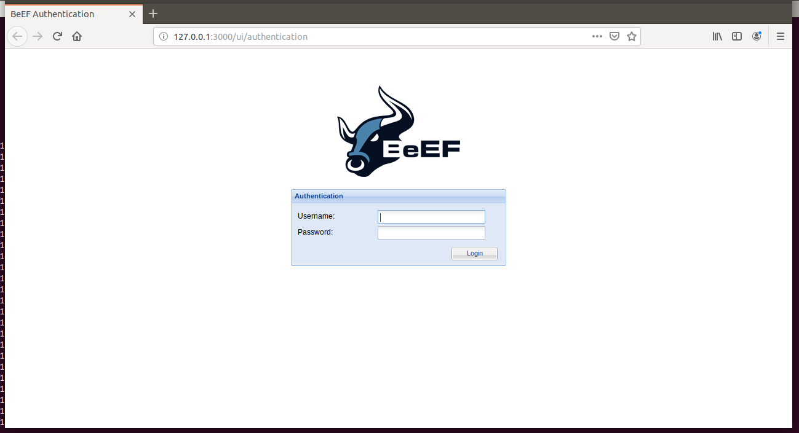

## BeEF step by step installation on Vagrant VM [Ubuntu 18.04]
### Note: This has been particularly written for the Vagrant VM provided for the Students of Cybersecurity Bootcamp, University of Toronto, Canada

```
sudo apt update
```

Now install Ruby and it Development suite

```
```

```
sudo apt install ruby ruby-dev -y
```

Change directory to `sysadmin` home

```
cd ~
```

Download the BeEF repository from GitHub using git clone

```
git clone https://github.com/beefproject/beef
```

Change directory to beef

```
cd beef
```

The initial screen will appear and ask for `'Y'` (Capital Y) to start the installation


Again you will be promped for

`Do you want to continue? [Y/n] Y`


type `'Y'` (Capital Y)

It might take a long time for `rubygems` to get updated and you might think your VM is hung. But it's normal and be patient.


Looks like installation is successful


now Change the password from **`beef`** to **`feeb`** or anything you want

```
nano config.yaml
```


Save your change and Exit nano

Run newly installed BeEF

```
./beef
```


Right Click on the link **`http://127.0.0.1:3000/ui/panel`** and select **`Open Link`**


Or you can paste the following link in your Vagrant VM's Web Browser (e.g. FireFox, Chrome)

```
http://127.0.0.1:3000/ui/panel
```

So its up and running




**Note:**

In a seperate case I encountered an error for not finding some gcc library files and got it fixed using the following installations

```
sudo add-apt-repository ppa:ubuntu-toolchain-r/test
```

If the add-apt-repository command cannot be found, run this instead


```
sudo apt install software-properties-common
```

```
sudo apt update
```

```
sudo apt install gcc-9
```


